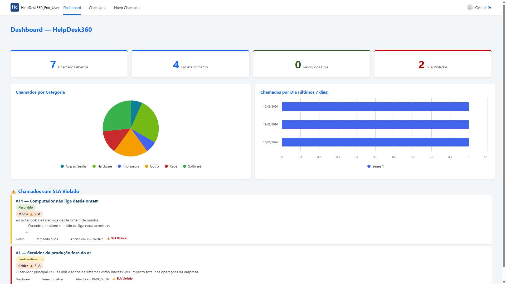
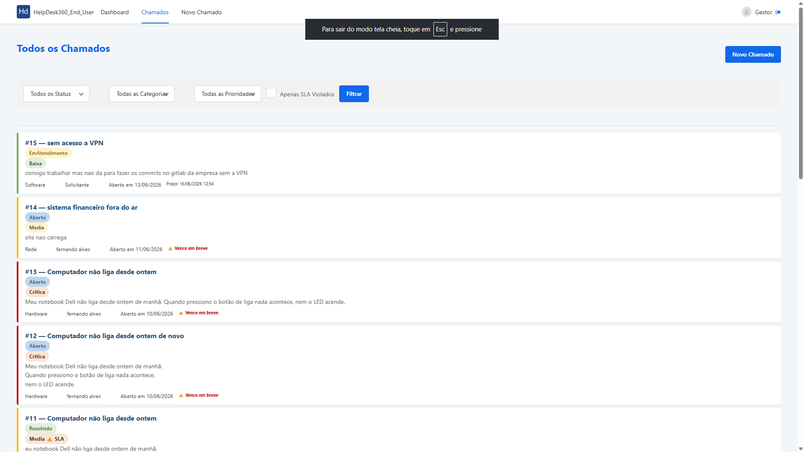
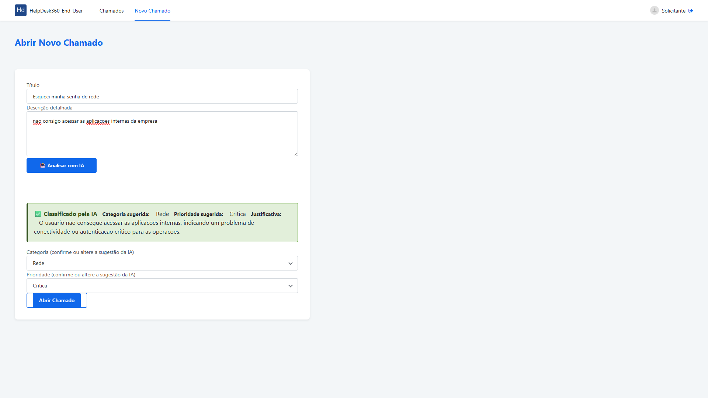
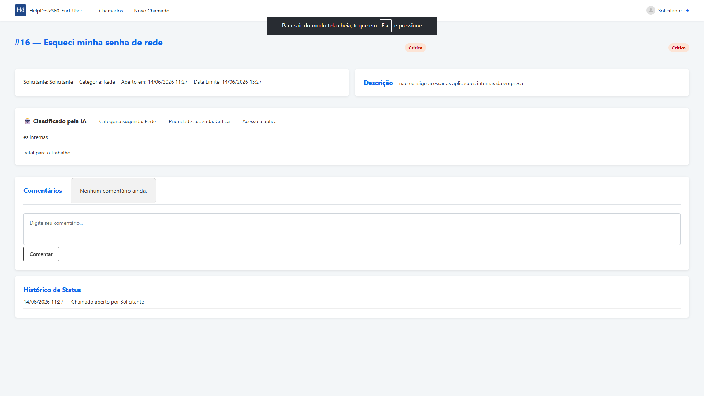

# HelpDesk360


> Sistema inteligente de gestão de chamados internos de TI desenvolvido em **OutSystems 11** com integração **Google Gemini AI** para triagem automática, gestão de SLA e dashboard gerencial em tempo real.

---

## 🎥 Demo

🔗 **[Aplicação ao vivo](https://personal-zhzcsdbi.outsystemscloud.com/HelpDesk360_End_User)**

> **Nota:** O ambiente é um Personal Environment do OutSystems. Caso esteja hibernado, pode levar alguns segundos para carregar.

**Credenciais de teste:**

| Perfil | Login | Senha |
|--------|-------|-------|
| Gestor | gestor@helpdesk360.com | (solicitar) |
| Atendente | atendente@helpdesk360.com | Admin1234! |
| Solicitante | solicitante@helpdesk360.com | Admin1234! |

---

## 📸 Screenshots

### Dashboard Gerencial


### Lista de Chamados


### Novo Chamado com IA


### Detalhe do Chamado


---

## 🚀 Sobre o Projeto

O HelpDesk360 resolve um problema real enfrentado por empresas de médio porte: a gestão de chamados internos de TI feita por e-mail e WhatsApp, sem rastreamento, sem SLA definido e sem visibilidade gerencial.

### O problema
- Chamados perdidos em caixas de e-mail
- Sem priorização estruturada
- Time de TI reativo e sem dados para decisão
- Sem histórico de atendimento

### A solução
Um sistema web completo com ciclo de vida estruturado, triagem por IA, SLA automático e dashboard gerencial — tudo desenvolvido com low-code em OutSystems 11.

---

## ✨ Funcionalidades

### 🙋 Solicitante
- Abertura de chamados com **triagem automática por IA** (categoria + prioridade sugeridas e editáveis)
- Acompanhamento do ciclo de vida em tempo real
- Comentários nos chamados
- Histórico completo de ações

### 🛠️ Atendente
- Visualização de todos os chamados com filtros avançados
- Atribuição e resolução de chamados
- Comentários internos (visíveis apenas para o time de suporte)
- Alertas de SLA próximo do vencimento por e-mail

### 📊 Gestor
- Dashboard com KPIs em tempo real
- Gráficos de distribuição por categoria e volume diário
- Lista de chamados com SLA violado em destaque
- Cancelamento de chamados e visibilidade total

### ⚙️ Automações
- Fechamento automático de chamados resolvidos após 72h (Timer)
- Alertas de SLA a cada 30 minutos (Timer)
- Cálculo automático de prazo por prioridade
- Notificações por e-mail em cada mudança de status

---

## 🏗️ Arquitetura

O projeto segue o padrão **Architecture Canvas** do OutSystems com **8 módulos** organizados em 3 camadas. As dependências fluem sempre de cima para baixo.

```
┌─────────────────────────────────────────────┐
│                 END-USER                    │
│            HelpDesk360                      │
│   Dashboard │ Lista │ Novo Chamado │ Detalhe │
└──────────────────┬──────────────────────────┘
                   │
┌──────────────────▼──────────────────────────┐
│                   CORE                      │
│                                             │
│  HelpDesk360_CS    │  HelpDesk360_BL        │
│  Entidades + CRUD  │  SLA + Validações      │
│  Timers            │  Transições de Status  │
│                    │                        │
│  HelpDesk360_CW — Blocos de UI              │
│  CardChamado │ Badges │ Dashboard │ Gráficos│
└──────────────────┬──────────────────────────┘
                   │
┌──────────────────▼──────────────────────────┐
│               FOUNDATION                    │
│                                             │
│  _AI_IS          │  _Notif_IS              │
│  Google Gemini   │  E-mail SMTP            │
│                  │                         │
│  _Th             │  _Lib                   │
│  CSS + Tema      │  Utilitários            │
└─────────────────────────────────────────────┘
```

### Módulos

| Módulo | Camada | Responsabilidade |
|--------|--------|-----------------|
| `HelpDesk360` | End-User | Telas, navegação e UI principal |
| `HelpDesk360_CS` | Core Services | Entidades, CRUD, Timers, orquestração |
| `HelpDesk360_BL` | Core Business Logic | SLA, validações, transições de status |
| `HelpDesk360_CW` | Core Widgets | Blocos reutilizáveis de UI |
| `HelpDesk360_AI_IS` | Foundation Integration | Wrapper Google Gemini API |
| `HelpDesk360_Notif_IS` | Foundation Integration | Templates de e-mail e notificações |
| `HelpDesk360_Th` | Foundation Theme | CSS customizado e tema visual |
| `HelpDesk360_Lib` | Foundation Library | Funções utilitárias genéricas |

---

## 🤖 Integração com IA

A triagem automática usa o **Google Gemini 2.5 Flash** via REST API.

**Fluxo:**
1. Solicitante descreve o problema em linguagem natural
2. Sistema envia o texto para o Gemini com um JSON Schema estruturado
3. IA retorna categoria, prioridade e justificativa em JSON
4. Campos são pré-preenchidos na tela com badge "Classificado pela IA"
5. Usuário confirma ou altera antes de salvar

**Princípios de IA responsável:**
- ✅ Transparência — badge visual identifica sugestões da IA
- ✅ Controle humano — todos os campos são editáveis
- ✅ Fallback gracioso — se a IA falhar, chamado abre com valores padrão
- ✅ Privacidade — apenas o texto de descrição é enviado, nunca dados pessoais

---

## 📊 Modelagem de Dados

**Static Entities (enums):**

| Entidade | Registros |
|----------|-----------|
| Status | Aberto, EmAtendimento, AguardandoUsuario, Resolvido, Fechado, Cancelado |
| Prioridade | Critica (2h SLA), Alta (8h), Media (24h), Baixa (72h) |
| Categoria | Hardware, Software, Rede, Acesso/Senha, Impressora, Outro |
| Perfil | Solicitante, Atendente, Gestor |

**Entidades principais:**

| Entidade | Descrição |
|----------|-----------|
| `Utilizador` | Estende User built-in com PerfilId e Departamento |
| `Chamado` | Entidade central com ciclo de vida completo e campos de IA |
| `Comentario` | Histórico de interações com flag de comentário interno |
| `HistoricoStatus` | Auditoria completa de todas as mudanças de status |
| `Notificacao` | Fila de notificações internas no sistema |

---

## 🔧 Regras de Negócio

### Ciclo de vida do chamado
```
Aberto ──► Em Atendimento ──► Aguardando Usuário
                │                      │
                └──────────────────────┘
                              │
                          Resolvido
                         /         \
                    Fechado      Em Atendimento
                  (auto 72h)      (reabertura)
```

### SLA por prioridade
| Prioridade | Prazo |
|------------|-------|
| Crítica | 2 horas |
| Alta | 8 horas |
| Média | 24 horas |
| Baixa | 72 horas |

---

## 🛠️ Tecnologias

| Tecnologia | Uso |
|-----------|-----|
| OutSystems 11 | Plataforma low-code (Reactive Web App) |
| Google Gemini 2.5 Flash | IA para triagem automática |
| OutSystems UI | Framework de UI e componentes |
| OutSystems Charts (Forge) | Gráficos do dashboard |
| SMTP / Gmail | Notificações por e-mail |

---

## 📁 Estrutura do Repositório

```
helpdesk360/
│
├── README.md
├── app/
│   └── HelpDesk360.oap        # Pacote exportado do OutSystems
│
├── docs/
│   └── HelpDesk360_Parte_Teorica.docx
│
├── css/
│   └── HelpDesk360_Th.css     # CSS do tema customizado
│
└── prints/
    ├── 01_login.png
    ├── 02_dashboard.png
    ├── 03_lista_chamados.png
    ├── 04_novo_chamado_ia.png
    ├── 05_detalhe_chamado.png
    └── 06_service_studio.png
```

---

## 📥 Como Importar o Projeto

1. Baixe o arquivo `app/HelpDesk360.oap`
2. Acesse seu ambiente OutSystems
3. Vá em **Service Center > Factory > Applications**
4. Clique em **Publish an Application**
5. Faça upload do `.oap`
6. Configure as Site Properties:
   - `Gemini_ApiKey` — sua chave da API Google Gemini
   - `Gemini_Model` — modelo desejado (ex: `gemini-2.5-flash`)
   - `Email_Remetente` — e-mail de envio
7. Configure o SMTP em **Service Center > Administration > Email**

---

## 🎓 Contexto Acadêmico

Projeto desenvolvido como **Trabalho Final** da disciplina de **Desenvolvimento de Aplicações Web Low-Code** na **UniFECAF (2026) + Rocketseat**.

**Critérios atendidos:**
- ✅ Aplicação web funcional em OutSystems 11
- ✅ CRUD completo (chamados)
- ✅ Arquitetura Canvas com 8 módulos
- ✅ Uso de IA (Google Gemini)
- ✅ Componente do Forge (Charts)
- ✅ Dashboard com indicadores e gráficos
- ✅ Automações via Timers
- ✅ Três perfis com controle de acesso

---

## 👨‍💻 Autor

**Fernando Zandonadi**

[](https://www.linkedin.com/in/fernandozandonadi)
[](https://github.com/fernandozandonadi)

---

*HelpDesk360 — Transformando o caos do suporte em processo estruturado com low-code e inteligência artificial.*
